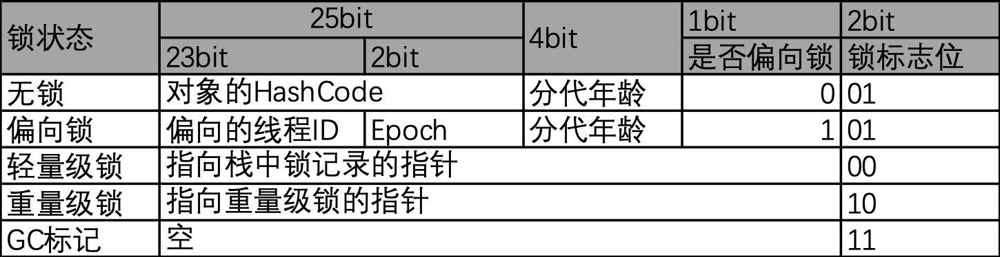
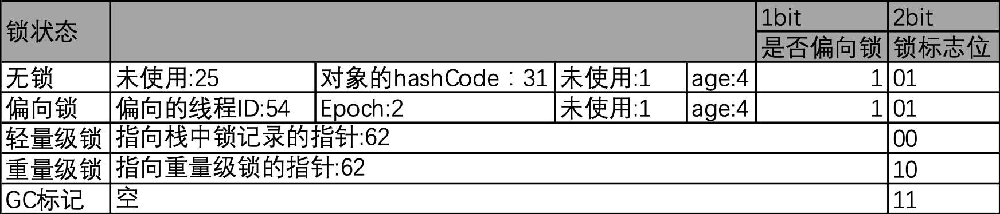

### 介绍
```synchronized```是java原生锁实现，只需要在需要加锁的方法或者代码块增加```synchronized```关键字，即可加锁完成，当并发情况下，只有获取锁的线程可以执行代码，其他线程需要等待锁被释放后获取锁才能执行相关代码。```synchronized```是可重入锁，同时它的实现是非公平锁。```synchronized```修饰的对象根据状态分为无锁、偏向锁、轻量级锁和重量级锁四种状态，锁的状态存储在对象头的markword，下面是两张图分别展示在32位虚拟机和64位虚拟机下对象不同状态的markword内容。
#### 32位

#### 64位

### MarkWord分析
我们使用jol来对对象头进行分析，需要增加maven依赖：
```
        <dependency>
            <groupId>org.openjdk.jol</groupId>
            <artifactId>jol-core</artifactId>
            <version>${jol.version}</version>
        </dependency>
```
这里推荐使用最新版本，新版本展示效果更佳直观。
代码运行前会先等待10秒，```Thread.sleep(10000L);```，这是因为jvm启动时默认把偏向锁的启用延迟了4秒，因为启动时需要加载大量资源，此时启用偏向意义不大。
#### 无锁
##### 演示代码
```
public class SyncTest {
    Object lock = new Object();
    ClassLayout lockLayout = ClassLayout.parseInstance(lock);
    public static void main(String[] args)throws Exception{
        Thread.sleep(10000L);
        SyncTest syncTest = new SyncTest();
        System.out.println(syncTest.lockLayout.toPrintable());
    }
}
```
##### 打印结果
```
java.lang.Object object internals:
OFF  SZ   TYPE DESCRIPTION               VALUE
  0   8        (object header: mark)     0x000000000000000d (biasable; age: 1)
  8   4        (object header: class)    0x00001000
 12   4        (object alignment gap)    
Instance size: 16 bytes
Space losses: 0 bytes internal + 4 bytes external = 4 bytes total
```
我们将markword转换成2进制结果如下```0000 0000 0000 0000 0000 0000 0000 0000 0000 0000 0000 0000 0000 0000 0000 1101```，根据markword在64位虚拟机下的结构可知锁标志位为```01```，是否偏向锁```1```，分代年龄```0001```，hashCode为空。
#### 偏向锁
##### 演示代码
```
public class SyncTest {
    Object lock = new Object();
    ClassLayout lockLayout = ClassLayout.parseInstance(lock);
    public static void main(String[] args)throws Exception{
        Thread.sleep(10000L);
        SyncTest syncTest = new SyncTest();
        System.out.println(syncTest.lockLayout.toPrintable());
        new Thread(()->{
            synchronized (syncTest.lock){
                System.out.println(syncTest.lockLayout.toPrintable());
            }
        }).start();
    }
}

```
##### 打印结果
```
java.lang.Object object internals:
OFF  SZ   TYPE DESCRIPTION               VALUE
  0   8        (object header: mark)     0x000000000000000d (biasable; age: 1)
  8   4        (object header: class)    0x00001000
 12   4        (object alignment gap)    
Instance size: 16 bytes
Space losses: 0 bytes internal + 4 bytes external = 4 bytes total

java.lang.Object object internals:
OFF  SZ   TYPE DESCRIPTION               VALUE
  0   8        (object header: mark)     0x00007f82362d080d (biased: 0x0000001fe08d8b42; epoch: 0; age: 1)
  8   4        (object header: class)    0x00001000
 12   4        (object alignment gap)    
Instance size: 16 bytes
Space losses: 0 bytes internal + 4 bytes external = 4 bytes total
```
在加锁前对象的markword和无锁状态一致，加锁后的markword转换为二进制```0000 0000 0000 0000 0000 0000 0111 1111 1000 0010 0011 0110 0010 1101 0000 1000 0000 1101```，有此可知锁标志位为```01```，是否偏向锁```1```，分代年龄```0001```，未使用位```0```，Epoch位```00```，偏向线程id```1111111100000100011011000101101000010```，转换为16进制为```1fe08d8b42```。

我们知道对象的hashCode一级生产就不会再变更了，对象的hashCode存储在对象的markword里，那么明显和偏向锁的结构有冲突，那如果我们在上边代码先调用对象的hashCode方法```syncTest.lock.hashCode();```和获取偏向锁之后调用hashCode的方法输出结果分别如下（省略无锁状态的输出）：
###### 获取锁之前
```
java.lang.Object object internals:
OFF  SZ   TYPE DESCRIPTION               VALUE
  0   8        (object header: mark)     0x000000030abf0a10 (thin lock: 0x000000030abf0a10)
  8   4        (object header: class)    0x00001000
 12   4        (object alignment gap)    
Instance size: 16 bytes
Space losses: 0 bytes internal + 4 bytes external = 4 bytes total
```
此时对象markword转换为二进制```0000 0000 0000 0000 0000 0000 0000 0000 0000 0011 0000 1010 1011 1111 0000 1010 0001 0000```，根据markword在64位虚拟机下的结构可知锁标志位为```00```，也就是轻量级锁，指向栈中锁记录的指针为```1100 0010 1010 1111 1100 0010 1000 0100````，转换为16进制为```c2afc284```。
###### 获取锁之后
```
java.lang.Object object internals:
OFF  SZ   TYPE DESCRIPTION               VALUE
  0   8        (object header: mark)     0x00007fdbac81e80d (biased: 0x0000001ff6eb207a; epoch: 0; age: 1)
  8   4        (object header: class)    0x00001000
 12   4        (object alignment gap)    
Instance size: 16 bytes
Space losses: 0 bytes internal + 4 bytes external = 4 bytes total

java.lang.Object object internals:
OFF  SZ   TYPE DESCRIPTION               VALUE
  0   8        (object header: mark)     0x00007fdbb000fe02 (fat lock: 0x00007fdbb000fe02)
  8   4        (object header: class)    0x00001000
 12   4        (object alignment gap)    
Instance size: 16 bytes
Space losses: 0 bytes internal + 4 bytes external = 4 bytes total
```
由结果可知，在hashCode方法执行之前，线程获取的锁还是偏向锁，但是在获取锁之后执行hashCode方法，锁膨胀为重量级锁，将markword转换为二进制为```0000 0000 0000 0000 0111 1111 1101 1011 1011 0000 0000 0000 1111 1110 0000 0010```，如图可知，锁标志位为```10```，指向重量级锁的指针为```0001 1111 1111 0110 1110 1100 0000 0000 0011 1111 1000 0000```，转换为16进制为```1ff6ec003f80```。  
由实现可知，锁对象一旦获取了hashCode，则线程就不能获取偏向锁，在调用hashCode之后获取锁得到的是轻量级锁，在获取偏向锁之后调用hashCode，偏向锁膨胀为重量级锁。
